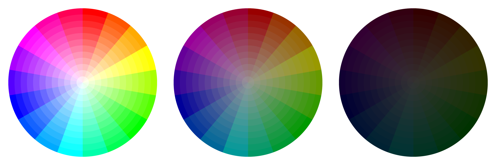
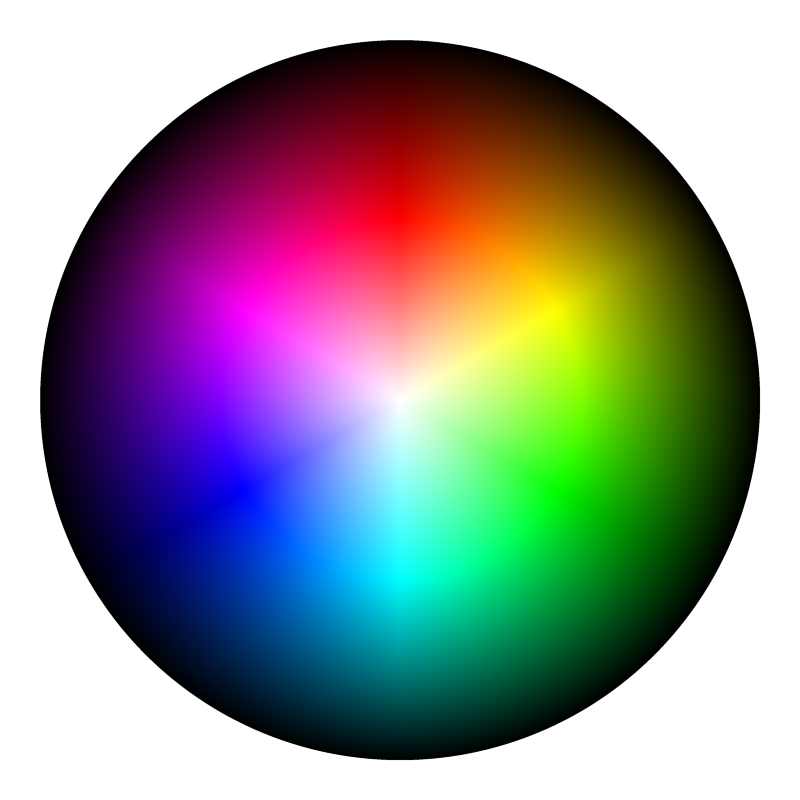

# Color Wheel Renderer

This tools lets you generate a wide variety of color wheels.

This is the Rust version of my [TypeScript color wheel renderer](https://github.com/jamesthurley/color-wheel-renderer).
The Rust version, unsurprisingly, runs much faster. If you are comparing performance, note that the Rust version defaults to 4x supersampling (configurable),
where as the TypeScript version only uses 2x supersampling.

## Build

```
cargo build --release
```

The repository contains a dev container configuration, so if you open this repository in a dev container or GitHub Codespace then running the above 
command should just work.

The compiled binaries will be located in `./target/release`.

## License

Color Wheel Renderer is released under the MIT License. See [LICENSE](LICENSE) file for details.

# Usage

Each color wheel represents a mapping from the **[3D HSL or HSV cylinder](https://en.wikipedia.org/wiki/HSL_and_HSV)** to a 2D circle. However this is not limited to a simple slice through the cylinder.

There are four base types of color wheel, two for HSL and two for HSV cylinders. For HSL there is either a fixed **lightness** or fixed **saturation**, and for HSV there is either a fixed **value** or fixed **saturation**.

In either case, you can specify one or more values for of the fixed variable.
Each fixed value will create a new color wheel, or if the `--expand` option is used it will expand a single
color wheel using each value in turn.

You can **bucket** in either the angular or radial directions using the `--angular-buckets` and `--radial-buckets` options.  

You can reverse the colors in the radial direction using the `--reverse-radial-colors` option.
This option also automatically reverses the radial bucketing direction from outwards to inwards, however you can also 
independently reverse the radial bucketing direction with the `--reverse-radial-bucketing` option.

You can set the diameter of each wheel in pixels using the `--diameter` option, and add a margin using the `--margin` option.


```
> color-wheel-cli --help

Usage: color-wheel-cli [OPTIONS] <COLOR_WHEEL_TYPE>

Arguments:
  <COLOR_WHEEL_TYPE>  [possible values: hsl-fixed-saturation, hsl-fixed-lightness, hsv-fixed-saturation, hsv-fixed-value]

Options:
  -a, --angular-buckets <COUNT>   Number of angular buckets to divide colors into. Defaults to 0, which gives a smooth output [default: 0]
  -r, --radial-buckets <COUNT>    Number of radial buckets to divide colors into. Defaults to 0, which gives a smooth output [default: 0]
  -f, --fixed <NUMBER>            Fixed values at which to render. Can be specified multiple times. Defaults to 0.5 for lightness or 1 for saturation and value
  -o, --output <FILE>             Path to file where color wheel should be saved
  -d, --diameter <PIXELS>         Diameter of the color wheel in pixels [default: 980]
  -m, --margin <PIXELS>           Size of margin around color wheel in pixels [default: 10]
  -e, --expand                    Add additional wheels to outside of previous wheel
  -c, --reverse-radial-colors     Reverses the order of colours from the center to edge of the wheel
  -b, --reverse-radial-bucketing  Reverses the direction of radial bucketing from the default. Defaults to outwards, or inwards if colors are reversed
  -s, --supersampling <COUNT>     [default: 4]
  -h, --help                      Print help
  -V, --version                   Print version
```

# Examples

## HSV Fixed Value
18 Angular Buckets, 12 Radial Buckets, 3 Values



```
color-wheel-cli hsv-fixed-value -f 1 -f 0.6 -f 0.2 -a 18 -r 12
```

---

## HSL Fixed Lightness
18 Angular Buckets, 12 Radial Buckets, 3 Lightness Values


```
color-wheel-cli hsl-fixed-lightness -f 0.8 -f 0.5 -f 0.2 -a 18 -r 12
```

---

## HSV Fixed Saturation
18 Angular Buckets, 12 Radial Buckets, 3 Saturation Values


```
color-wheel-cli hsv-fixed-saturation -f 1 -f 0.6 -f 0.2 -a 18 -r 12
```

---

## HSL Fixed Saturation
18 Angular Buckets, 12 Radial Buckets, 3 Saturation Values


Note that for this wheel the outermost band is white.

```
color-wheel-cli hsl-fixed-saturation -f 1 -f 0.6 -f 0.2 -a 18 -r 12
```

---

## OKLAB Fixed Chroma
3 Chroma Values


```
color-wheel-cli oklab-fixed-lightness -f 0.085 -f 0.2 -f 0.35
```

---

## OKLAB Fixed Lightness
3 Lightness Values


```
color-wheel-cli oklab-fixed-lightness -f 0.1 -f 0.5 -f 1.0
```

---

## HSL Fixed Saturation Smooth
No Bucketing


```
color-wheel-cli hsl-fixed-saturation
```

---

## HSL Fixed Saturation Smooth Reversed Colors
No Bucketing, Reversed Colors



```
color-wheel-cli hsl-fixed-saturation -c
```

---

## HSL Fixed Saturation Angular Bucketing
36 Angular Buckets


```
color-wheel-cli hsl-fixed-saturation -a 36
```

---

## HSL Fixed Saturation Radial Bucketing
12 Radial Buckets


Note that for this wheel the outermost band is white.

```
color-wheel-cli hsl-fixed-saturation -r 12
```

---

## HSV Fixed Saturation Expand
12 Angular Buckets, 5 Radial Buckets, 3 Saturation Values, Expand Color Wheel


```
color-wheel-cli hsv-fixed-saturation -f 0.25 -f 0.5 -f 1 -a 18 -r 12 -e
```

---

## HSL Fixed Saturation Expand
12 Angular Buckets, 5 Radial Buckets, 3 Saturation Values, Expand Color Wheel, Reverse Bucketing Direction


```
color-wheel-cli hsl-fixed-saturation -f 0.1 -f 0.5 -f 1 -a 18 -r 12 -e -b
```

---

## HSV Fixed Saturation Coarse Bucketing
12 Angular Buckets, 5 Radial Buckets


```
color-wheel-cli hsv-fixed-saturation -a 12 -r 5
```

---

## Full Script
The following script generates the exact set of color wheels rendered on this page.

Note that the HSL Fixed Saturation wheels which use radial bucketing have a white outer band, 
which obviously won't be visible if you're viewing this on a white page.
An alternative to this would be to reverse the radial bucketing direction with the 
`--reverse-radial-bucketing` option. This would in turn result in the center circle being pure black, which may or may not be desirable.

```
color-wheel-cli hsv-fixed-value -f 1 -f 0.6 -f 0.2 -a 18 -r 12 -d 720 -m 40 -o color-wheel-hsv-fixed-value-three.png
color-wheel-cli hsl-fixed-lightness -f 0.8 -f 0.5 -f 0.2 -a 18 -r 12 -d 720 -m 40 -o color-wheel-hsl-fixed-lightness-three.png
color-wheel-cli hsv-fixed-saturation -f 1 -f 0.6 -f 0.2 -a 18 -r 12 -d 720 -m 40 -o color-wheel-hsv-fixed-saturation-three.png
color-wheel-cli hsl-fixed-saturation -f 1 -f 0.6 -f 0.2 -a 18 -r 12 -d 720 -m 40 -o color-wheel-hsl-fixed-saturation-three.png
color-wheel-cli oklab-fixed-chroma -f 0.085 -f 0.2 -f 0.35 -a 18 -r 12 -d 720 -m 40 -o color-wheel-oklab-fixed-chroma-three.png
color-wheel-cli oklab-fixed-lightness -f 0.1 -f 0.5 -f 1.0 -d 720 -m 40 -o color-wheel-oklab-fixed-lightness-three.png
color-wheel-cli hsl-fixed-saturation -d 720 -m 40 -o color-wheel-hsl-fixed-saturation-smooth.png
color-wheel-cli hsl-fixed-saturation -c -d 720 -m 40 -o color-wheel-hsl-fixed-saturation-smooth-reversed-colors.png
color-wheel-cli hsl-fixed-saturation -a 36 -d 720 -m 40 -o color-wheel-hsl-fixed-saturation-angular.png
color-wheel-cli hsl-fixed-saturation -r 12 -d 720 -m 40 -o color-wheel-hsl-fixed-saturation-radial.png
color-wheel-cli hsv-fixed-saturation -f 0.25 -f 0.5 -f 1 -a 18 -r 12 -e -d 720 -m 40 -o color-wheel-hsv-fixed-saturation-expand.png
color-wheel-cli hsl-fixed-saturation -f 0.1 -f 0.5 -f 1 -a 18 -r 12 -e -b -d 720 -m 40 -o color-wheel-hsl-fixed-saturation-expand.png
color-wheel-cli hsv-fixed-saturation -a 12 -r 5 -d 720 -m 40 -o color-wheel-hsv-fixed-saturation-coarse.png
```
